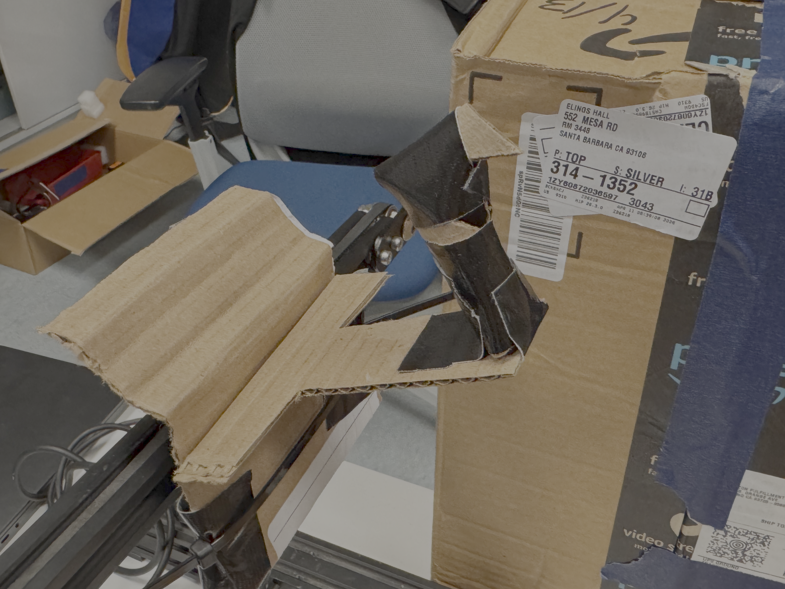
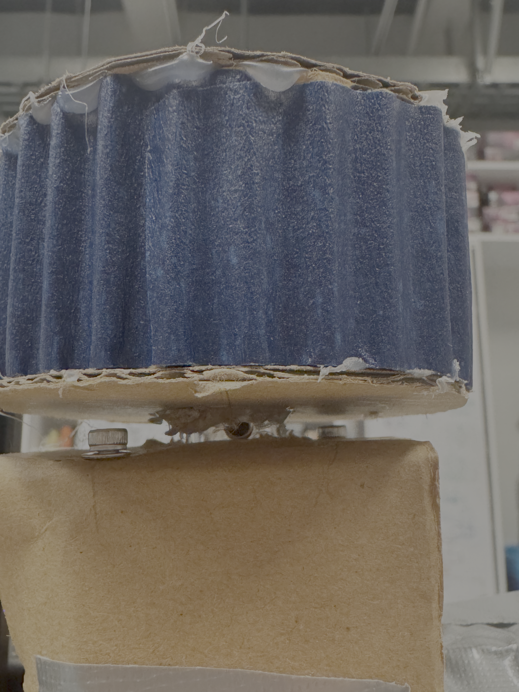
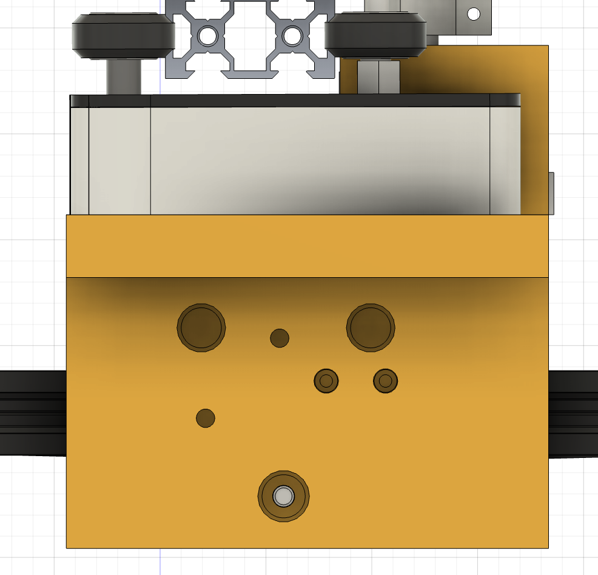
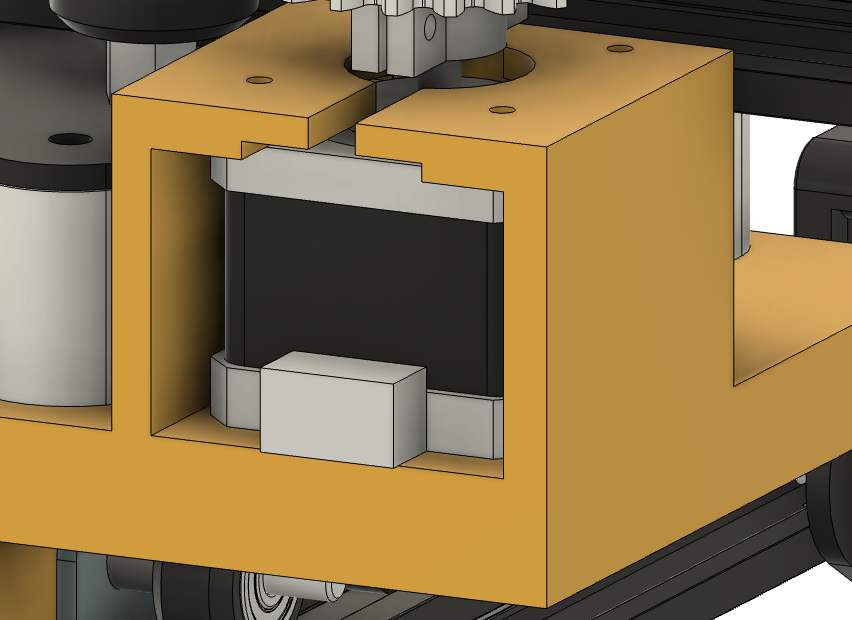
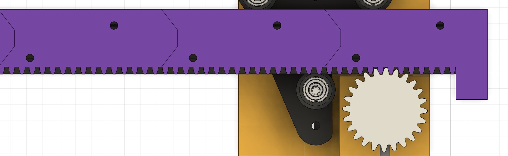
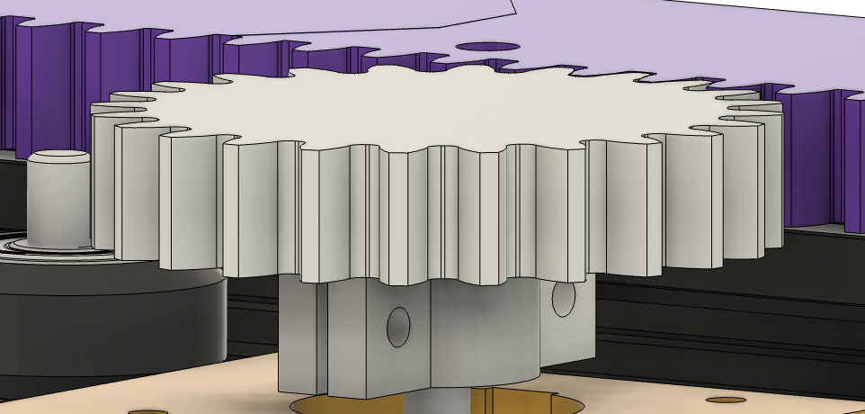
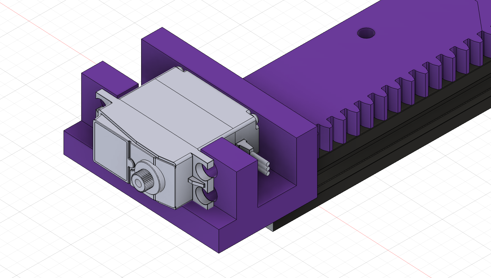
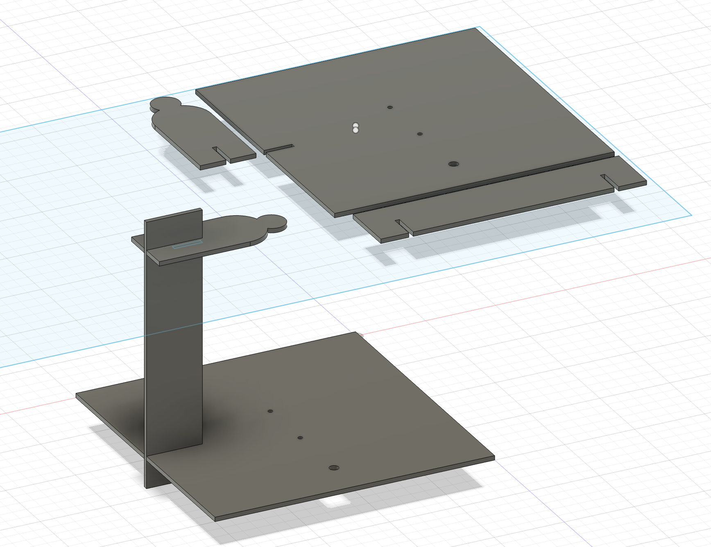
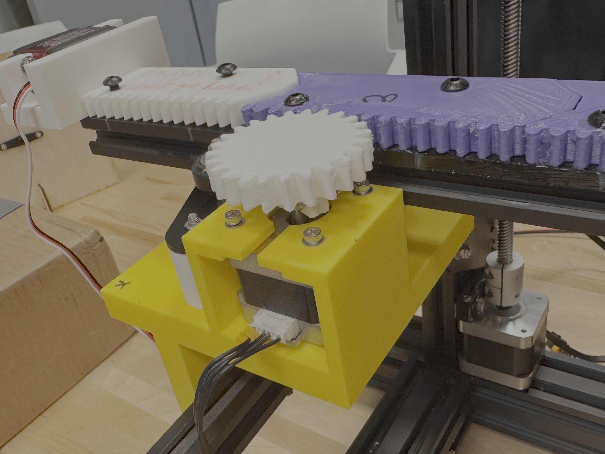
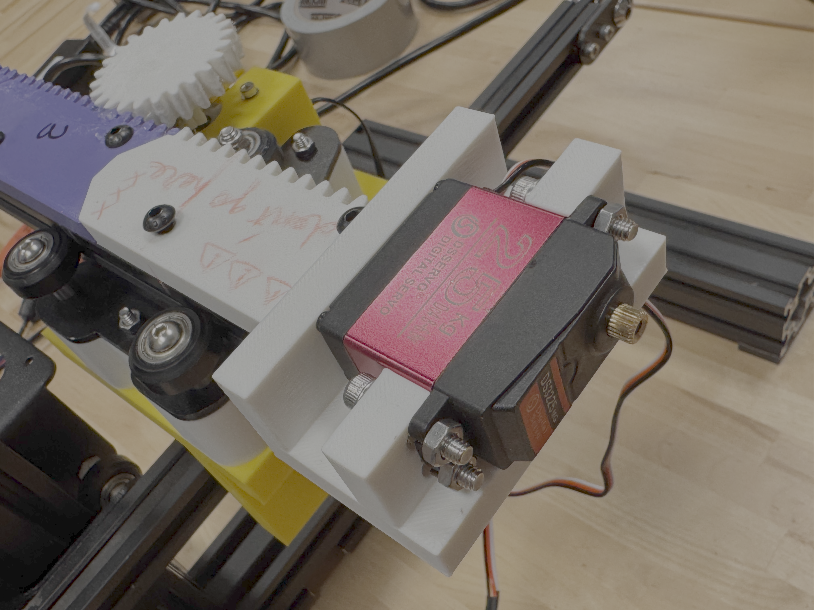

# Project 2: Anti Gravity 3D Printer Movement

[View the Project Proposal](proposal.md)

## Concept

Modifying a 3D printer to create an interactive experience that simulates anti-gravity camera movement and prototype for a anti-gravity camera. Using the idea of third person perspective to create immersiveness and enhance the feeling of existence of gravity.

## Design


The first design decision is whether to modify a 3D printer, or build a scara like robotic arm, or design a completely new machanism. As the concept was not clear enough at the time, modifying 3D printer seems to be more practical and imaginable. This is minor but important for me to build the mind model of how the machine might look like.

Secondly is to decide how to possibly implement the XY plane rotation, which provides the core feeling of tumbled gravity. (I realized this as this decision is made) At this point we've disassembled the Ender (the 3D printer we're using) and are lost in where to start, especially in where should I place the Z axis, should I even add XZ plane rotation, and how could we possible do the XY and other planes' rotation. After talking with Jennifer, I found out it is possible to add another arm to the existing the arm, and add a rotation head at the end of the new arm, implement by a servo motor. The servo won't be able to support the full 360 degree of rotation but with 180, it is enough to provide a basic feeling of tumbled gravity. So I decided to go with this as it really scaled down the concept and now I realized the city model can be just in front of the camera, thus I need to worry less about XY rotation. To this point, the 8-DoF original plan is now scaled down to 4, namely X, Y, Z movement and XY plane rotation.

The next step is to design how to add another arm and the mechanism to move it. This is a very interesting designing process and is very different from what I imagined to be. I tried to keep drawing more sketches to indicate the design but it seems hard to visualize. So Ale suggested me to start with cardboards and use whatever way to add the arm with cardboard, tapes, straps, screws, glue guns or whatever is useful. As the arm is wiggly and very unelegantly attached, we started to think where to put the motor to drive it, and miraculously, a gear and rack prototypr is made, which worked really well to move the added arm. That's where we went back to CAD and design. This process of moving from imagination to physical prototyping and back to CAD is something I've never experienced before, and I would say this is what I learned the most from this project.

The rest is more straight forward, I decided to use cardboards for city and place it in front the machine, doing more CAD for 3D printing and laser cutting the parts, and the idea of the machine gets clearer and settled.

The last design decision is, given there's only 2 encoder input, I decided to combine rotation and Z axis, so when the camera is up the gravity is totally reversed, and there's a middle Z position where the camera is 90 degrees. This made the camera movement more intuitive and less space for the user to get lost and constantly rotating the camera which seems meaningless and not really gravity fighting. And this resulted in a pretty good feeling of gravity tumbling, as some feedbacks are "this feels like a roller coaster rising or other amusement park facilities", "feels like in space station".

## Implementation

### Hardware Setup

**Prototyping 1**



First I tried mounting only the iphone camera with cardboards and tapes.


Then I built the city model with cardboards, decided it should go in front of the machine.

<iframe width="560" height="315" src="https://youtube.com/shorts/qAtx7Ns-uT8" title="YouTube video player" frameborder="0" allow="accelerometer; autoplay; clipboard-write; encrypted-media; gyroscope; picture-in-picture; web-share" referrerpolicy="strict-origin-when-cross-origin" allowfullscreen></iframe>

Connected stepdance board. The movement of the camera looks promising.

**Prototyping 2**


Then we added the arm and the gear and rack mechanism with cupboards, tapes and straps.


First we took the other Z arm of the ender and the connecting wheels of the other Z arm with the printer arm, placed it horizontally, using the screw holes originally for the extruder to attach the plate. 
 


Then we found the place to place the stepper motor, and designed the gear and rack mechanism to connect the motor and the arm. We hot glued a tiny ring with the clamping screw to the shaft.

<iframe width="560" height="315" src="https://youtube.com/shorts/w0vBpj5Kxks" title="YouTube video player" frameborder="0" allow="accelerometer; autoplay; clipboard-write; encrypted-media; gyroscope; picture-in-picture; web-share" referrerpolicy="strict-origin-when-cross-origin" allowfullscreen></iframe>

Conneced to stepdance, worked well. Ready for fabrication.


These are all the middle products in iteration.

**Prototyping 3**

<iframe width="560" height="315" src="https://youtube.com/shorts/krHDLqiyBvk" title="YouTube video player" frameborder="0" allow="accelerometer; autoplay; clipboard-write; encrypted-media; gyroscope; picture-in-picture; web-share" referrerpolicy="strict-origin-when-cross-origin" allowfullscreen></iframe>

After this I did all the CAD and 3D printed the parts. 




The connection to arm part happened to be a variation of the famous "cheese", with extra room for the motor. I added a lifter for the arm, which is the white part, so the plate for the new arm is not wiggly and the gear and rack have a closer contact to pass the force.



Then I followed a tutorial to design the gear and rack. We splited the rack in 4 parts and decided to use T-Nuts to connect them to the arm. This was a hard decision but thankfully it worked well.



The connection of the gear to the shaft was tricky because the shaft is short and it need to be sturdy enough to pass the force. I designed a clamp with 2 screws and extension plane so that it passes force firmly but also don't hit anything.




Lastly was the servo holder and the phone holder, combined with the figure. The servo holder is connected with the final rack, and the phone holder is laser cut so it is lighter. I made the figure old social media default profile vibe. The connection to the servo is tricky, eventually I have to drill the servo arm which is super stiff and small.





These are the final machine. Assembling was a pain. We have to change the gear motor, which is the extruder motor, with the Z motor because the design was referencing the Z motor and the size were different, and the part is massive we didn't want to reprint that. However, the extruder motor, which is stronger, happened to be the one we needed exactly for Z because the extra arm is heavy and tend to pull the arm down. Then the plate for new arm was wiggly and we have to add a ton of washers, and finally decided to add the white part to hold it uptight. T-nuts assembly was also not easy, but the hot glue method worked well. The gear to shaft assembly was tricky, have to really tight up the screws in a very small limited space. The servo's model I found was not as accurate, and the arm needs to be drilled, and the connection point of the servo to the phone holder was small, I should have screwed it in. Also did a lot of soldering and crimpping. But, in the end the machine worked, and made this all worth it.


I redesigned the city so it has middle part and top part, so the three low, mid, top mode makes sense.


### Code Overview

The X and Y axis are directly mapped to the 2 encoders.

```cpp
// -- Position Generators
PositionGenerator position_gen_servo;
PositionGenerator position_gen_z;

// -- Scaling filter for attempted coordinated servo/ z movement --
ScalingFilter1D rotation_gen;
```

These are the main generators and a scaling filter for combining the Z and servo rotation.

```cpp
// -- Configure Position Generator --
position_gen_servo.output.map(&channel_r.input_target_position);
position_gen_servo.begin();
position_gen_z.output.map(&channel_z.input_target_position);
position_gen_z.begin();

rotation_gen.begin();
rotation_gen.set_ratio(1420, 200);  // maxium z axis is 250 mm
                                    // 1500 of the servo is 190 degrees
rotation_gen.input.map(&channel_z.input_target_position);
rotation_gen.output.map(&channel_r.input_target_position);
```

The Z axis is mapped to the servo rotation using a scaling filter. 2 tricky parts are here. First the servo was not moving correctly, after Jennifer fixed it to 190 with +/- 750 for maximum movement distance, I got to map it to 180 degrees. Secondly the position generators must be started before scaling filter otherwise it won't work at all.

```cpp
rpc.begin();
  rpc.enroll("disable_z_mapping", disable_z_mapping);
  rpc.enroll("enable_z_mapping", enable_z_mapping);
  rpc.enroll("down", down);
  rpc.enroll("mid", mid);
  rpc.enroll("up", up);
  // rpc.enroll("minusTest", minusTest);
  // rpc.enroll("positiveTest", positiveTest);

  // -- Start the stepdance library --
  // This activates the system.
  dance_start();
  disable_z_mapping();
```

```cpp
// {"name":"disable_z_mapping"}
void disable_z_mapping() {
  rotation_gen.output.disable();
}
// {"name":"enable_z_mapping"}
void enable_z_mapping() {
  rotation_gen.output.enable();
  position_gen_servo.go(710, ABSOLUTE, 100);  // go to the bottom, and then assemble the thing
}

// {"name":"down"}
void down() {
  // rotation_gen.output.disable();
  // position_gen_servo.go(710, ABSOLUTE, 100);
  position_gen_z.go(0, ABSOLUTE, 10);  // positive is down for z, 10 is a great speed
  // rotation_gen.output.enable();
}

// {"name":"mid"}
void mid() {
  // rotation_gen.output.disable();
  // position_gen_servo.go(0, ABSOLUTE, 100);
  position_gen_z.go(-100, ABSOLUTE, 10);  // positive is down for z, 10 is a great speed
  // rotation_gen.output.enable();
}

// {"name":"up"}
void up() {
  // rotation_gen.output.disable();
  // position_gen_servo.go(-710, ABSOLUTE, 100);
  position_gen_z.go(-200, ABSOLUTE, 10);  // positive is down for z, 10 is a great speed, 180 is basically 25cm for the servo
  // rotation_gen.output.enable();
}
```

These are the remote series commands. Down, mid and up control the Z, which then will be mapped to the servo movement. The disable and enable is for the servo driver's refresing. Because we're using absolue mode and this was how our servo is set, the correct way to use the machine is always manually move z to the bottom, connect the board, enable the mapping and wait for it to go to -90 degrees, then mount the phone holder up tight and start recording, control via encoders and series commands. Not the optimal way, but works.


## Results

<iframe width="560" height="315" src="https://youtu.be/Fuea3KvjHP4" title="YouTube video player" frameborder="0" allow="accelerometer; autoplay; clipboard-write; encrypted-media; gyroscope; picture-in-picture; web-share" referrerpolicy="strict-origin-when-cross-origin" allowfullscreen></iframe>

<iframe width="560" height="315" src="https://youtu.be/UGfdAK_jXnM" title="YouTube video player" frameborder="0" allow="accelerometer; autoplay; clipboard-write; encrypted-media; gyroscope; picture-in-picture; web-share" referrerpolicy="strict-origin-when-cross-origin" allowfullscreen></iframe>

<!--
<video width="560" controls>
  <source src="assets/demo-video.mp4" type="video/mp4">
</video>
-->

## Reflection

I really learned a lot and these has been more or less covered previously. First is to scale down an idea first especially if it's not a very usual one. Secondly, the physical process of prototying really helps to build the mind model and know what actually works and what doesn't. Third is don't freak out, beacuse eventually things are working. Thank you so much Jennifer Ale and Emilie, this is a very valuable experience.

What I would do differently, or to say what I would include if I have more time is the robustness of this machine. In the final result, the machine need to be set up in a very specific way, and there was no limiter on the X, Y nor Z. The camera holder is also mounted badly. One more thing I would do is to make the user interface better, adding video streaming so it makes more sense when the user is driving it. Make a better box. Adding some preset routes so the user get to know better what this was for. Also, I could reframe the city, or even make multiple cities, and extend the Y arm so it has more of a exploring a tunnel by fighting gravity vibe. And maybe print faces or back of people's head out and attach to the figure. I imagined that would be fun.

I proudly gained my first scar out of this class and I love it. Thank you again for all the instructors and classmates.