## Proposal & Mid-point review 

###Concept
Kinetic Light Traces is a light sculpture that explores the relationship between motion, light, and material transformation. The project uses four stepper motors moving at different speeds and ranges to generate dynamic trajectories in space. LEDs mounted on the moving structure create light traces that become visible through long-exposure photography, producing a form of kinetic light calligraphy.

A second goal of the project is to investigate how existing machines can be reimagined and transformed into new systems. The sculpture is constructed from repurposed components of a Creality Ender 3 3D printer. By disassembling and reconfiguring the printer's mechanical and electronic components, the project explores alternative motion systems while providing an opportunity to learn about motor control, motion programming, and kinetic design.

The original concept also included an energy harvesting system inspired by a bicycle dynamo. The intention was for the stepper motors to function both as actuators and generators, producing electrical energy that could be stored and used to power the LEDs. Although this system was not completed in the current prototype, it remains an important direction for future development toward a self-powered kinetic light sculpture.

### Mechanical Structure
Four stepper motors are mounted radially around a central hub assembled from 2020 V-slot aluminum extrusion and corner brackets. Each motor drives a distinct motion axis:

* M1 and M2 drive opposing horizontal belt-and-carriage axes at high speed (100–150 mm/s), producing short bright bursts of light along two vectors.
* M3 drives a vertical leadscrew axis with sinusoidal velocity variation at low speed, carrying a horizontal acrylic disc mounted to the carriage. Motion is slow and breath-like.
* M4 drives a second acrylic disc in continuous 360-degree rotation via a 5mm shaft hub. A 6-wire capsule slip ring maintains electrical continuity to the LEDs as the disc rotates.

High-brightness white LEDs (10mm, >5000 mcd) are mounted on each moving element — on the carriages of M1, M2, and M3, and on the rotating disc of M4. The circular afterimage produced by M4 and the linear traces left by M1/M2/M3 coexist in the viewer’s visual field.

### Energy Conversion Circuit
Each motor coil generates AC back-EMF during operation. A per-axis circuit converts this to usable DC:

* Isolation diodes (1N4007 x2 per motor) prevent reverse current from entering the Stepdance TMC2209 drivers.
* A bridge rectifier module converts AC coil output to pulsed DC.
* A 1F 5.5V supercapacitor buffers energy and sustains LED output for approximately 3–5 seconds after motor deceleration.
* A high-brightness white LED with a 47Ω current-limiting resistor is the terminal load.

LED brightness and fade duration are entirely determined by motor velocity and deceleration profile — parameters under direct Stepdance control. The circuit introduces no independent logic; it is a passive transducer between mechanical energy and light.

### Stepdance Control
The Stepdance Driver Module (Teensy 4.1 + TMC2209 drivers) controls all four axes in real time using the Stepdance Software Library (SSL):

* M1 and M2 execute high-speed reciprocating motion via move_to() at maximum feasible velocity, producing maximum LED brightness during transit and sharp afterimage onset at reversal.
* M3 uses sinusoidal velocity modulation via millis()-based time parameterization, making the vertical light column appear to breathe.
* M4 uses set_velocity() for continuous rotation at a speed calibrated to produce a stable circular afterimage.
* 
Stepdance’s real-time control architecture is central to this project. The ability to modulate motor velocity continuously without G-code latency or positional abstraction makes it possible to treat velocity as a light-intensity parameter. The SSL is used here not to move an end-effector to a target, but to compose a temporal light event.

### Materials
Reused from Disassembled Ender 3:

* NEMA 17 stepper motors x4
* 2020 V-slot aluminum rails x2, leadscrew + brass nut (Z-axis)
* GT2 timing belts, GT2 pulleys (20T), V-slot wheels and carriage plates x2
* Stepdance Driver Module (Teensy 4.1 + TMC2209 x4)

To Be Acquired:

* 2020 V-slot rail 400mm x2, V-slot gantry carriage plates x2
* GT2 idler pulleys x4, NEMA 17 motor mount brackets x4, corner brackets x8
* Acrylic circular discs 150mm x2, 5mm shaft hub x1, slip ring 6-wire capsule x1
* Bridge rectifier modules x4, 1N4007 diodes, 1F 5.5V supercapacitors x4
* High-brightness white LEDs 10mm, 47Ω resistors

###Sketch

