# Final Project: Kinetic Light Traces

[Proposal & Mid-point Review](Mid-pointreview.md)

[Project 2 Peer Review](PeerReview.md)

## Concept

Kinetic Light Traces is a kinetic sculpture built from components of a Creality Ender 3 FDM 3D printer and controlled through the Stepdance. The sculpture uses three stepper motors and one Servo motor (360 rotate) arranged in a radial configuration to generate coordinated movements and dynamic spatial patterns. LEDs attached to the moving structure emphasize these trajectories, creating light traces that become particularly visible through long-exposure photography.

The project explores how movement can be translated into visual marks in space, creating a form of kinetic light calligraphy. By assigning different speeds and motion ranges to each axis, the sculpture produces continuously evolving patterns that reveal the temporal and spatial qualities of motion.

A second objective of the project is to investigate the creative reuse of existing machines. Rather than constructing a system from entirely new components, the project repurposes and reconfigures parts from a discarded 3D printer into a new kinetic mechanism. Through this process, the work examines how existing technologies can be transformed into new artistic and functional systems.

The original concept also included an energy harvesting system in which the stepper motors would function both as actuators and generators. Inspired by the principle of a bicycle dynamo, the generated electrical energy would be rectified, stored in a supercapacitor, and used to power the LEDs mounted on the sculpture. Due to time constraints and delays in obtaining key electronic components, this system was not implemented in the final prototype. However, the concept remains an important direction for future development toward a self-powered kinetic light sculpture.

## Design
The project began with experiments using stepper motors both as actuators and generators. Initial tests focused on measuring voltage output from motor movement and evaluating methods for storing generated energy.

Several mechanical configurations were explored before settling on a radial arrangement inspired by rotational and flower-like structures. Components from a disassembled Creality Ender 3 printer were reused as the primary structural elements, reducing material waste while providing a robust motion platform.

The vertical axis was modified from a lead screw mechanism to a belt-driven system. This change increased movement speed and enabled smoother, more dynamic motion for the kinetic sculpture.

The final design consists of three motorized axes built from repurposed Creality Ender 3 components. Two linear axes provide horizontal and vertical motion, while a third motor drives a rotating platform mounted at the top of the structure.

The horizontal axis serves as the base movement, allowing the entire assembly to travel along the X direction. The vertical axis moves independently along the Z direction, creating layered motion patterns. A rotating disk mounted on the upper section introduces continuous rotational movement, enabling attached LEDs to generate circular and spiral light traces.

The structure is assembled from aluminum extrusions, V-slot wheels, belts, pulleys, and stepper motors recovered from the original printer. Custom 3D-printed brackets and mounts were designed to connect the axes and support the rotating platform.

By combining linear translation and rotation, the system produces complex trajectories in space that can be captured through long-exposure photography, creating dynamic light drawings and motion-based visual compositions.


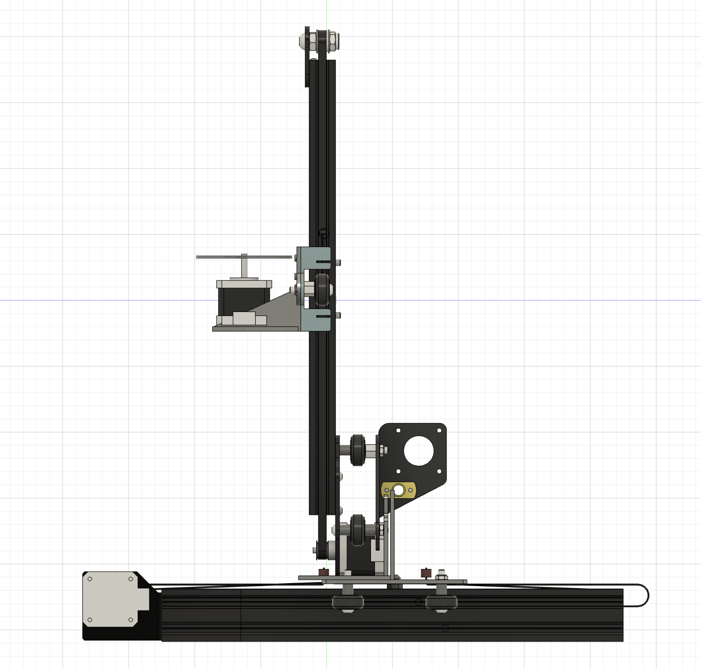
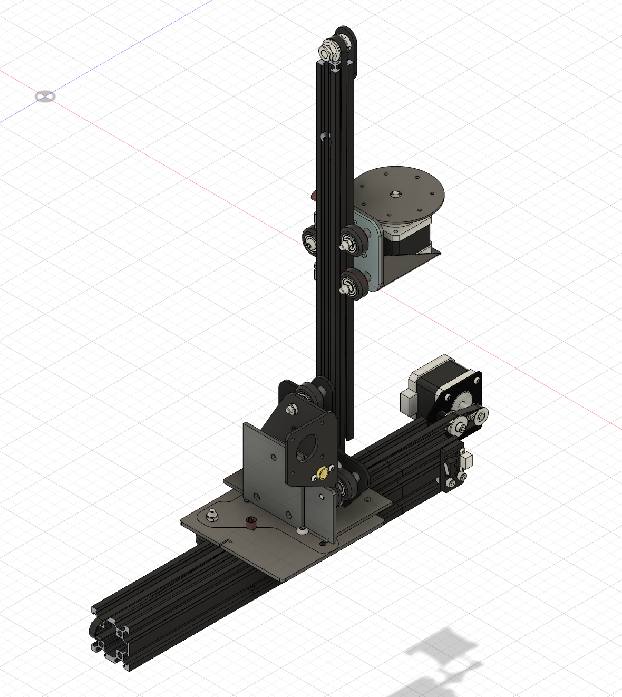

### Mount desgin
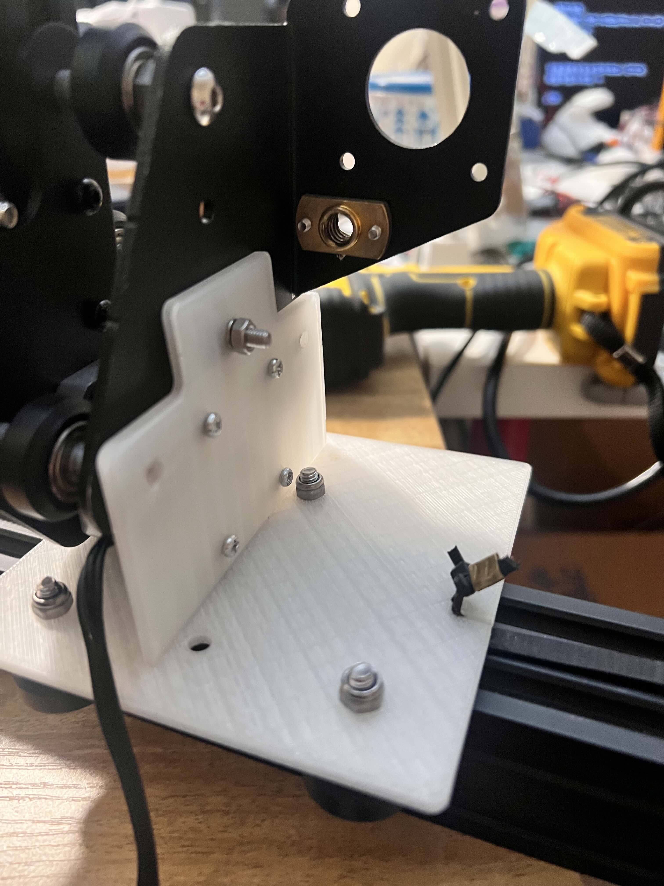
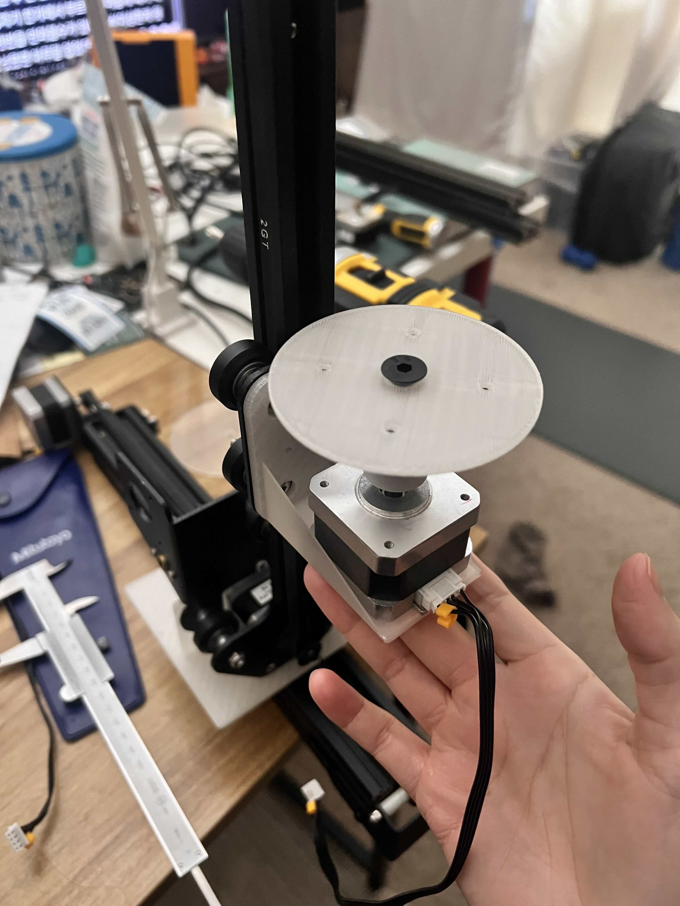


## Implementation
The final prototype was developed using the Stepdance running on a Teensy 4.1 microcontroller. The mechanical structure was constructed components of a Ender 3D printer, including linear motion elements, aluminum extrusions, and stepper motors. Three stepper motors and one servo motor were arranged in a radial configuration to create coordinated kinetic movements.

The primary focus of the implementation was the development of the motion control system. Through Stepdance, each motor was assigned a different behavior, including oscillatory movement, continuous rotation, and speed-controlled motion. Physical controls such as potentiometers and rotary encoders were used to adjust movement speed and range in real time, allowing for experimentation with different kinetic patterns.

The project explored how variations in speed, synchronization, and movement trajectories could produce different visual and spatial experiences. LEDs were integrated into the moving structure to enhance the visibility of motion and emphasize the dynamic patterns generated by the sculpture.


Energy System

The original concept of the project was to create a self-powered kinetic light sculpture in which the stepper motors would function both as actuators and as generators. The generated electrical energy would be rectified through a bridge rectifier, stored in a supercapacitor, and used to power LEDs mounted on the moving structure. This approach was intended to establish a direct relationship between movement, energy generation, and light output.

Due to time constraints and delays in obtaining several electronic components, the energy harvesting system was not fully realized in the final prototype. Instead, the project focused on developing the mechanical structure, motion control system, and overall interaction between movement and light.

Although the self-powered lighting system remains unimplemented, the current prototype establishes the foundation for future development. The next stage of the project will involve integrating the rectification and energy storage circuitry to realize the original goal of transforming mechanical movement directly into illumination.

### Hardware Setup

* Teensy 4.1 running the Stepdance framework
* Three stepper motors
* One servo motor
* LEDs
* Components from a Creality Ender 3 printer: Motors, Extrusions, gantry wheel plates 


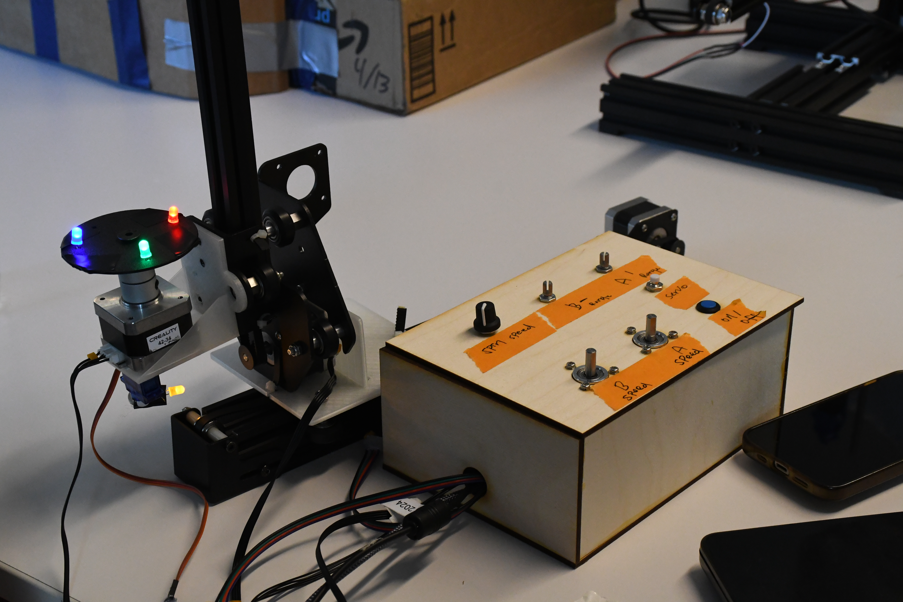

### Code Overview
The system is controlled through the Stepdance on a Teensy 4.1. The code manages three stepper motor outputs and one continuous rotation servo. Each motor has a different movement behavior, allowing the sculpture to combine linear bouncing motion, exact range-based oscillation, continuous spinning, and servo-based rotation.

The code uses several Stepdance objects to organize input, output, and motion generation. Encoder objects are used to read the two rotary encoders, which control the speed of Motor A and Motor B. AnalogInput objects read the potentiometers: A1 controls the range of Motor A, A2 controls the range of Motor B, and A3 controls the spinning speed of Motor C as well as the servo speed. Button objects are used for the master on/off control and the independent servo on/off control.

For motor output, the code uses OutputPort and Channel objects. Each output port is connected to a channel, and each channel is mapped to a motion generator. Motor A and Motor C use VelocityGenerator, which allows continuous speed-based motion. Motor B uses PositionGenerator, which allows it to move precisely between 0 and a target range. The servo is also controlled with a PositionGenerator, using target values to start, stop, or adjust rotation.

In the setup() function, the analog inputs, encoders, buttons, output ports, channels, and generators are initialized. The code maps each generator output to the corresponding channel target position using .output.map(&channel.input_target_position). The motors are then enabled with enable_drivers(), and Stepdance is started using dance_start().

In the main loop(), the system continuously reads the physical controls, updates motor behavior, handles button states, prints serial status information, and runs the Stepdance update loop through dance_loop(). If the master button is turned on, the motors begin moving. If it is turned off, all motors and the servo stop.

Motor A creates a continuous bouncing motion by estimating its position over time and reversing direction when it reaches the minimum or maximum range. Motor B moves exactly between 0 and the range value using positionGenB.go(). Motor C spins continuously using velocityGenC.speed_units_per_sec, controlled by potentiometer A3. The servo can be toggled independently while the whole system is active.

The code also includes real-time serial monitoring. It prints the on/off states, motor ranges, motor speeds, spin speed, servo value, and estimated positions. CPU usage is monitored using stepdance_get_cpu_usage() through a periodic LoopDelay call.

```cpp
/*


## STEPDANCE MULTI-MOTOR CONTROLLER

OUTPUT_A : Linear Stepper A
Continuous back-and-forth motion
Range controlled by A1
Speed controlled by Encoder 1

OUTPUT_B : Linear Stepper B
Exact 0 <-> Range oscillation
Range controlled by A2
Speed controlled by Encoder 2

OUTPUT_C : Continuous Spinning Stepper
Speed controlled by A3

OUTPUT_D : Continuous Rotation Servo
Speed controlled by A3
Independent ON/OFF via D2

---

## INPUT MAPPING

ENCODER_1 : Adjust Stepper A speed
ENCODER_2 : Adjust Stepper B speed

IO_A1     : Stepper A travel range
IO_A2     : Stepper B travel range
IO_A3     : Stepper C spin speed
+ Servo rotation speed

IO_D1     : Master ON/OFF
Enables or disables all motors

IO_D2     : Servo ON/OFF
Only affects OUTPUT_D

---

## BEHAVIOR

D1 ON:

* Stepper A starts bouncing
* Stepper B starts oscillating
* Stepper C starts spinning
* Servo automatically starts

D1 OFF:

* All motion stops
* Servo stops

D2:

* Toggles servo independently
* Works only when D1 is ON

A3:

* Controls both Stepper C speed
* Controls Servo rotation speed
  


OUTPUT_A = Stepper A / bounce
OUTPUT_B = Stepper B / exact 0 <-> range bounce
OUTPUT_C = Stepper C / continuous spin
OUTPUT_D = Continuous rotation servo

ENCODER_1 = A speed
ENCODER_2 = B speed

IO_A1 = A range
IO_A2 = B range
IO_A3 = C spin speed + Servo speed

IO_D1 = ALL ON/OFF
IO_D2 = Servo ON/OFF
*/

#define module_driver
#include "stepdance.hpp"

// INPUTS
Encoder encoder_1;
Encoder encoder_2;

AnalogInput analog_a1;
AnalogInput analog_a2;
AnalogInput analog_a3;

Button button_d1;
Button button_d2;

// OUTPUTS
OutputPort output_a;
OutputPort output_b;
OutputPort output_c;
OutputPort output_d;

// CHANNELS
Channel channel_a;
Channel channel_b;
Channel channel_c;
Channel channel_servo;

// GENERATORS
VelocityGenerator velocityGenA;
PositionGenerator positionGenB;
VelocityGenerator velocityGenC;
PositionGenerator servoGen;

// SETTINGS
float min_pos = 0.0;

float max_pos_a = 100.0;
float max_pos_b = 100.0;

float speed_a = 50.0;
float speed_b = 50.0;

float min_range_a = 10.0;
float max_range_a = 300.0;

float min_range_b = 10.0;
float max_range_b = 300.0;

float min_speed_a = 5.0;
float max_speed_a = 200.0;

float min_speed_b = 5.0;
float max_speed_b = 200.0;

float encoder_speed_step_a = 0.05;
float encoder_speed_step_b = 0.05;

float last_encoder_value_a = 0.0;
float last_encoder_value_b = 0.0;

// A3 controls both C stepper speed and servo speed
float min_spin_speed_c = 0.0;
float max_spin_speed_c = 2000.0;
float spin_speed_c = 0.0;

// SERVO
float servo_stop_value = -90.0;   // confirmed stop value
float servo_speed_value = -90.0;  // controlled by A3
float servo_move_speed = 2000.0;

// POSITIONS
float estimated_pos_a = 0.0;
float estimated_pos_b = 0.0;

int direction_a = 1;

bool b_moving_to_max = true;
bool b_command_sent = false;

// STATES
bool all_on = false;
bool servo_on = false;

// TIMING
uint32_t last_time = 0;
uint32_t last_print = 0;

LoopDelay overhead_delay;

// --------------------------------------------------
// SETUP
// --------------------------------------------------

void setup() {

  Serial.begin(115200);

  // POTENTIOMETERS
  analog_a1.set_floor(min_range_a, 25);
  analog_a1.set_ceiling(max_range_a, 1020);
  analog_a1.begin(IO_A1);

  analog_a2.set_floor(min_range_b, 25);
  analog_a2.set_ceiling(max_range_b, 1020);
  analog_a2.begin(IO_A2);

  // A3 = C spin speed
  analog_a3.set_floor(min_spin_speed_c, 25);
  analog_a3.set_ceiling(max_spin_speed_c, 1020);
  analog_a3.begin(IO_A3);

  // ENCODERS
  encoder_1.begin(ENCODER_1);
  encoder_1.set_ratio(1.0, 1.0);

  encoder_2.begin(ENCODER_2);
  encoder_2.set_ratio(1.0, 1.0);

  last_encoder_value_a = encoder_1.read();
  last_encoder_value_b = encoder_2.read();

  // BUTTONS
  button_d1.begin(IO_D1, INPUT_PULLDOWN);
  button_d1.set_mode(BUTTON_MODE_STANDARD);
  button_d1.set_callback_on_press(&toggle_all);

  button_d2.begin(IO_D2, INPUT_PULLDOWN);
  button_d2.set_mode(BUTTON_MODE_STANDARD);
  button_d2.set_callback_on_press(&toggle_servo);

  // OUTPUT_A
  output_a.begin(OUTPUT_A);
  channel_a.begin(&output_a, SIGNAL_E);
  channel_a.set_ratio(40, 3200);
  channel_a.invert_output();

  // OUTPUT_B
  output_b.begin(OUTPUT_B);
  channel_b.begin(&output_b, SIGNAL_E);
  channel_b.set_ratio(40, 3200);
  channel_b.invert_output();

  // OUTPUT_C = SPIN STEPPER
  output_c.begin(OUTPUT_C);
  channel_c.begin(&output_c, SIGNAL_E);
  channel_c.set_ratio(360, 3200);

  // OUTPUT_D = SERVO
  output_d.begin(OUTPUT_D);
  channel_servo.begin(&output_d, SIGNAL_E);
  channel_servo.set_ratio(1, 1);

  enable_drivers();

  // GENERATORS
  velocityGenA.begin();
  positionGenB.begin();
  velocityGenC.begin();
  servoGen.begin();

  velocityGenA.output.map(&channel_a.input_target_position);
  positionGenB.output.map(&channel_b.input_target_position);
  velocityGenC.output.map(&channel_c.input_target_position);
  servoGen.output.map(&channel_servo.input_target_position);

  last_time = millis();

  dance_start();

  stop_all_motion();
  force_servo_off();

  Serial.println("Ready");
  Serial.println("D1 = ALL ON/OFF");
  Serial.println("D2 = SERVO ON/OFF");
  Serial.println("A3 = C speed + Servo speed");
}

// --------------------------------------------------
// LOOP
// --------------------------------------------------

void loop() {

  overhead_delay.periodic_call(&report_overhead, 500);

  read_controls();

  if (all_on) {
    auto_bounce_motion();
  } else {
    stop_all_motion();
  }

  if (!all_on) {
    servo_on = false;
    force_servo_off();
  } else {
    if (servo_on) {
      run_servo();
    } else {
      force_servo_off();
    }
  }

  print_status();

  dance_loop();
}

// --------------------------------------------------
// BUTTONS
// --------------------------------------------------

void toggle_all() {

  all_on = !all_on;

  if (all_on) {

    start_all_motion();

    servo_on = true;
    run_servo();

    Serial.println("D1: ALL ON + SERVO ON");

  } else {

    all_on = false;
    servo_on = false;

    stop_all_motion();
    force_servo_off();

    Serial.println("D1: ALL OFF + SERVO OFF");
  }
}

void toggle_servo() {

  if (!all_on) {
    servo_on = false;
    force_servo_off();
    Serial.println("D2 ignored: ALL OFF");
    return;
  }

  servo_on = !servo_on;

  if (servo_on) {
    run_servo();
    Serial.println("D2: SERVO ON");
  } else {
    force_servo_off();
    Serial.println("D2: SERVO OFF");
  }
}

// --------------------------------------------------
// START / STOP
// --------------------------------------------------

void start_all_motion() {

  enable_drivers();

  last_time = millis();

  estimated_pos_b = 0.0;
  b_moving_to_max = true;
  b_command_sent = false;

  velocityGenC.speed_units_per_sec = spin_speed_c;
}

void stop_all_motion() {

  velocityGenA.speed_units_per_sec = 0;
  velocityGenC.speed_units_per_sec = 0;

  positionGenB.go(estimated_pos_b, ABSOLUTE, 1);
}

// --------------------------------------------------
// SERVO
// --------------------------------------------------

void run_servo() {
  servoGen.go(servo_speed_value, ABSOLUTE, servo_move_speed);
}

void force_servo_off() {
  servoGen.go(servo_stop_value, ABSOLUTE, servo_move_speed);
}

// --------------------------------------------------
// READ CONTROLS
// --------------------------------------------------

void read_controls() {

  // A range
  max_pos_a = analog_a1.read();

  if (estimated_pos_a > max_pos_a) {
    estimated_pos_a = max_pos_a;
  }

  // B range
  max_pos_b = analog_a2.read();

  if (estimated_pos_b > max_pos_b) {
    estimated_pos_b = max_pos_b;
  }

  // A3 controls C spin speed
  spin_speed_c = analog_a3.read();

  // A3 also controls servo speed
  // spin_speed_c: 0~300
  // servo_speed_value: -90~180
  servo_speed_value = -90.0 + (spin_speed_c / max_spin_speed_c) * 270.0;

  // A speed encoder
  float encoder_value_a = encoder_1.read();
  float diff_a = encoder_value_a - last_encoder_value_a;

  if (diff_a != 0) {
    speed_a += diff_a * encoder_speed_step_a;
    speed_a = constrain(speed_a, min_speed_a, max_speed_a);
    last_encoder_value_a = encoder_value_a;
  }

  // B speed encoder
  float encoder_value_b = encoder_2.read();
  float diff_b = encoder_value_b - last_encoder_value_b;

  if (diff_b != 0) {
    speed_b += diff_b * encoder_speed_step_b;
    speed_b = constrain(speed_b, min_speed_b, max_speed_b);
    last_encoder_value_b = encoder_value_b;
  }
}

// --------------------------------------------------
// MOTION
// --------------------------------------------------

void auto_bounce_motion() {

  uint32_t now = millis();
  float dt = (now - last_time) / 1000.0;
  last_time = now;

  // A bounce
  estimated_pos_a += direction_a * speed_a * dt;

  if (estimated_pos_a >= max_pos_a) {
    estimated_pos_a = max_pos_a;
    direction_a = -1;
  }

  if (estimated_pos_a <= min_pos) {
    estimated_pos_a = min_pos;
    direction_a = 1;
  }

  velocityGenA.speed_units_per_sec = direction_a * speed_a;

  // B exact 0 <-> max_pos_b
  if (!b_command_sent) {
    positionGenB.go(max_pos_b, ABSOLUTE, speed_b);
    b_moving_to_max = true;
    b_command_sent = true;
    estimated_pos_b = 0.0;
  }

  if (b_moving_to_max) {

    estimated_pos_b += speed_b * dt;

    if (estimated_pos_b >= max_pos_b) {
      estimated_pos_b = max_pos_b;
      positionGenB.go(0.0, ABSOLUTE, speed_b);
      b_moving_to_max = false;
    }

  } else {

    estimated_pos_b -= speed_b * dt;

    if (estimated_pos_b <= 0.0) {
      estimated_pos_b = 0.0;
      positionGenB.go(max_pos_b, ABSOLUTE, speed_b);
      b_moving_to_max = true;
    }
  }

  // C continuous stepper spin
  velocityGenC.speed_units_per_sec = spin_speed_c;
}

// --------------------------------------------------
// SERIAL PRINT
// --------------------------------------------------

void print_status() {

  if (millis() - last_print > 300) {

    Serial.print("ALL: ");
    Serial.print(all_on ? "ON" : "OFF");

    Serial.print(" | Servo: ");
    Serial.print(servo_on ? "ON" : "OFF");

    Serial.print(" | A Range: ");
    Serial.print(max_pos_a, 2);

    Serial.print(" | A Speed: ");
    Serial.print(speed_a, 2);

    Serial.print(" | B Range: ");
    Serial.print(max_pos_b, 2);

    Serial.print(" | B Speed: ");
    Serial.print(speed_b, 2);

    Serial.print(" | C Spin: ");
    Serial.print(spin_speed_c, 2);

    Serial.print(" | Servo Speed Value: ");
    Serial.print(servo_speed_value, 2);

    Serial.print(" | A Pos: ");
    Serial.print(estimated_pos_a, 2);

    Serial.print(" | B Pos: ");
    Serial.println(estimated_pos_b, 2);

    last_print = millis();
  }
}

// --------------------------------------------------
// CPU USAGE
// --------------------------------------------------

void report_overhead() {
  Serial.print("CPU Usage: ");
  Serial.println(stepdance_get_cpu_usage(), 4);
}
ㅡ 
```

## User Control
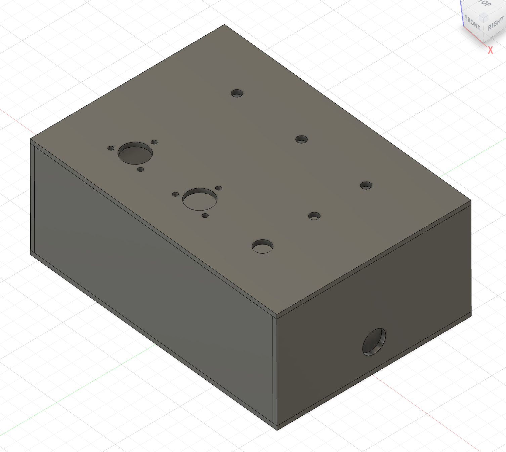

The kinetic sculpture is controlled through a set of physical interfaces that allow real-time adjustment of movement behaviors:

- Encoder 1 controls the movement speed of Motor A.
- Encoder 2 controls the movement speed of Motor B.
- Potentiometer 1 adjusts the travel range of Motor A.
- Potentiometer 2 adjusts the travel range of Motor B.
- Potentiometer 3 controls the rotational speed of Motor C, which carries the LED light source.
- Button 1 toggles the continuous rotation servo motor on and off.
- Button 2 enables or disables the entire kinetic system.
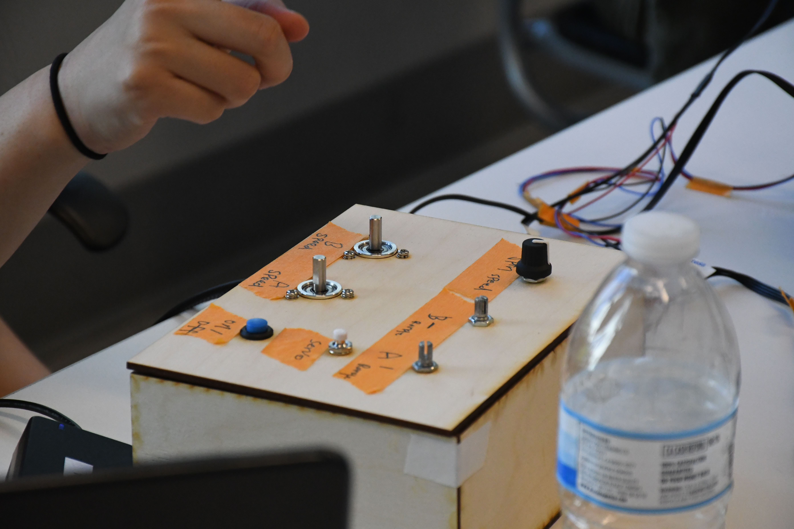


## Results


<iframe width="560" height="315" src="https://www.youtube.com/embed/6srXsoYSdd0?si=afzlRaO6InUvjWya" title="YouTube video player" frameborder="0" allow="accelerometer; autoplay; clipboard-write; encrypted-media; gyroscope; picture-in-picture; web-share" referrerpolicy="strict-origin-when-cross-origin" allowfullscreen></iframe>

<iframe width="560" height="315" src="https://www.youtube.com/embed/C0NqdqLuidw?si=j1xt3A-cOZrMQ4h_" title="YouTube video player" frameborder="0" allow="accelerometer; autoplay; clipboard-write; encrypted-media; gyroscope; picture-in-picture; web-share" referrerpolicy="strict-origin-when-cross-origin" allowfullscreen></iframe>

<iframe width="560" height="315" src="https://www.youtube.com/embed/Bf_SgmbT00o?si=AKEPtHaDCVTIu3QY" title="YouTube video player" frameborder="0" allow="accelerometer; autoplay; clipboard-write; encrypted-media; gyroscope; picture-in-picture; web-share" referrerpolicy="strict-origin-when-cross-origin" allowfullscreen></iframe>


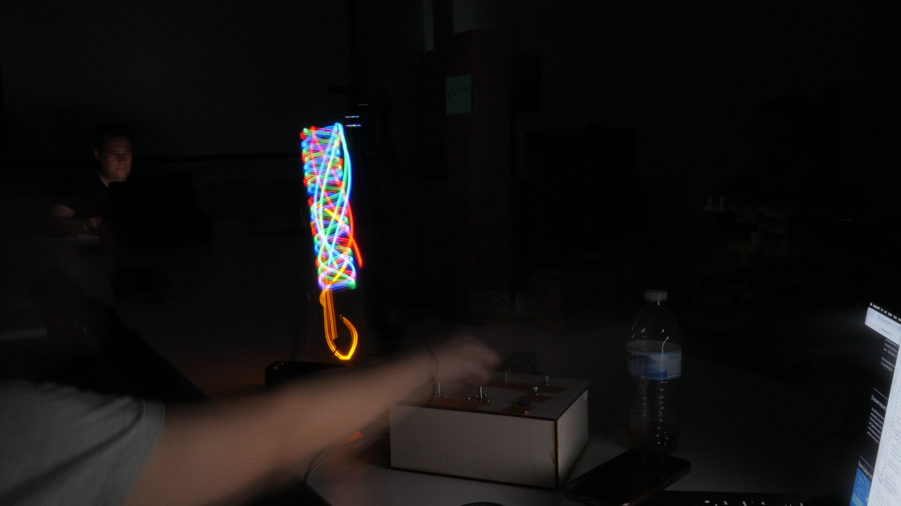
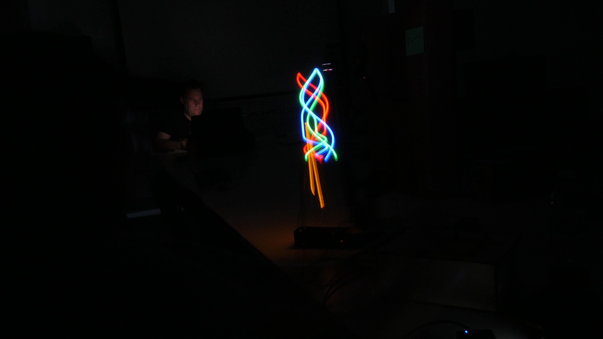
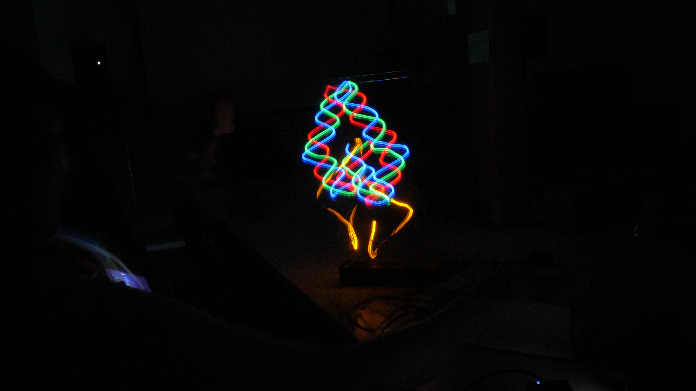
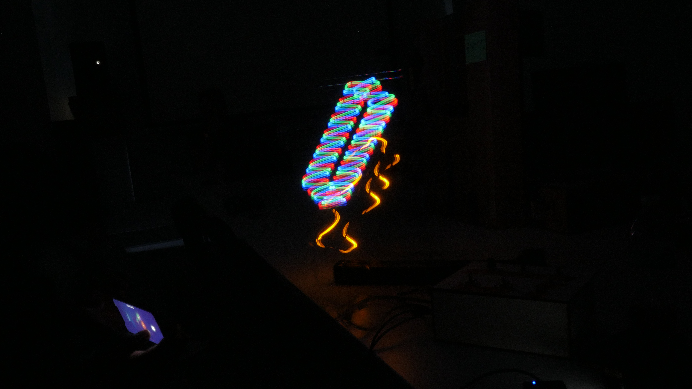
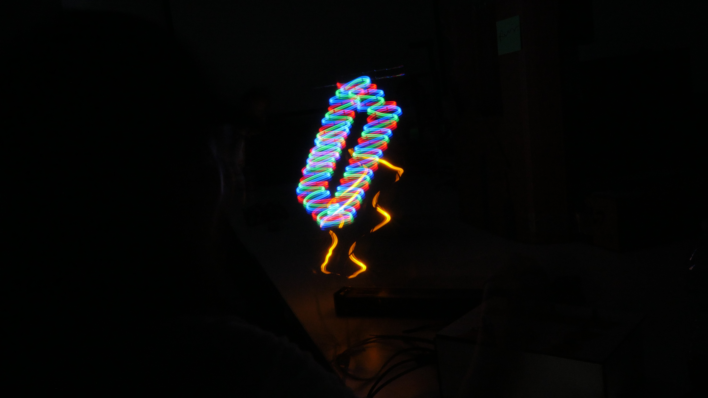


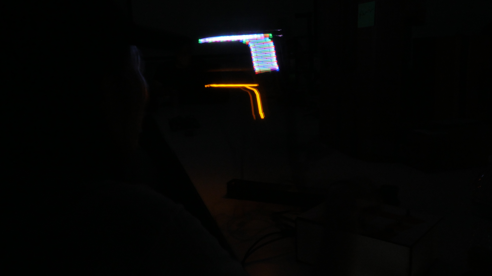
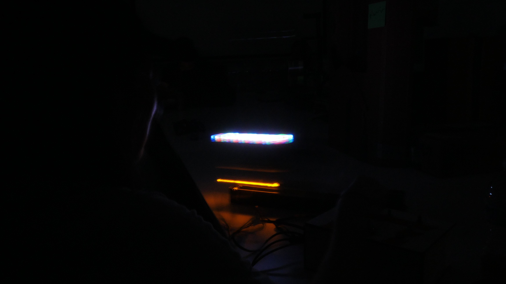


## Reflection
My original plan was to create a light calligraphy sculpture using multiple motorized axes moving at different speeds and trajectories. However, several electronic components did not arrive on time, and I did not have enough time to fully develop the project as originally envisioned.

The final sculpture was built primarily from components of a Creality Ender 3 3D printer, along with a number of custom 3D-printed mounts for the motors and linear slides. One of the most meaningful aspects of the project was taking apart an existing machine and reassembling its components into something entirely different. This process encouraged me to think about reuse, adaptation, and the creative potential of existing materials.

Throughout the project, I learned a great deal about motion control and stepper motor systems. I gained a better understanding of current control and motor tuning to achieve stable movement while preventing the motors from overheating during extended operation.

The original concept also included an energy harvesting system in which the stepper motors would generate electricity to power LEDs, creating a self-powered kinetic light sculpture. Due to limited time and delays in obtaining key electronic components, this system could not be completed within the project timeline. This experience highlighted the importance of prototyping critical subsystems early in the development process and allowing sufficient time for sourcing, testing, and integration.

If I continue developing this project, I would focus on implementing the energy harvesting circuit and expanding the motion system to create more complex light-drawing behaviors. The current prototype establishes a strong foundation for these future developments.
